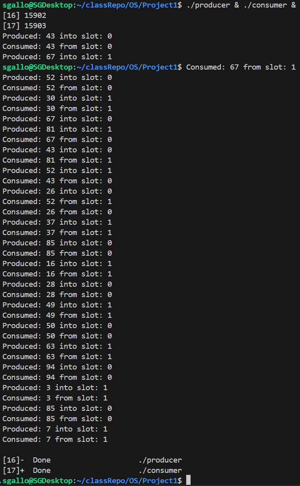

# CS 33211 Operating Systems Project 1: Producer-Consumer Problem


## To Compile and run
Compile and run using these commands in your Linux terminal

```bash
g++ producer.cpp -pthread -lrt -o producer
g++ consumer.cpp -pthread -lrt -o consumer
./producer & ./consumer
```

## Examples

